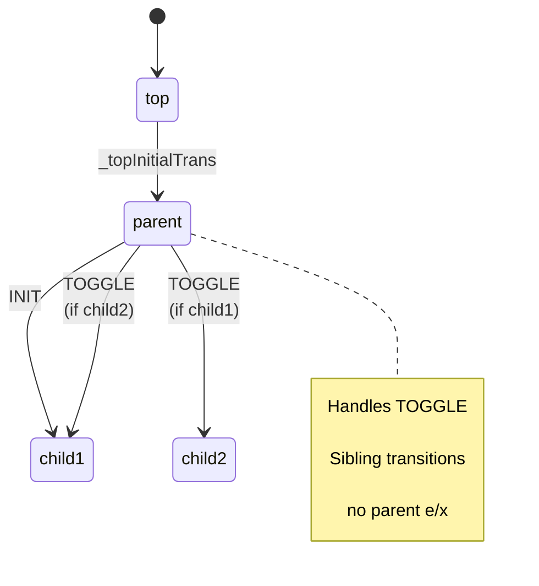

# libhsm
[](https://github.com/rifatsahiner/libhsm/blob/main/LICENSE)
[](https://github.com/rifatsahiner/libhsm)
[](https://en.cppreference.com/w/cpp/17)

**Lightweight Hierarchical State Machine (HSM) library for C++17. Fully UML-compliant with support for all transition semantics, entry/exit actions, guards, and nested initial transitions. Zero dependencies, single header + source.**

## 🚀 Features

- **Complete UML HSM Support**: All 8 transition types (self, sibling, ancestor, outer/inner), deep hierarchies, guards, actions
- **Zero Dependencies**: Pure C++17, no external libraries or runtime overhead
- **Type-Safe & Efficient**: Compile-time checks, `event_cast<T>`, inline handlers, no vtables
- **Easy Integration**: CMake, pkg-config, modern installers
- **Rich Examples**: Interactive oven/toaster, FLTK GUI calculator, full transition tester
- **Debug-Friendly**: Runtime type checks (NDEBUG), assertions, full tracing in examples

## 📦 Installation

```bash
git clone https://github.com/rifatsahiner/libhsm.git
cd libhsm
mkdir build && cd build
cmake ..
cmake --build . -j
sudo cmake --install .
```

**Using pkg-config:**
```bash
g++ main.cpp $(pkg-config --cflags --libs hsm) -o app
```

**Using CMake:**
```cmake
find_package(hsm REQUIRED)
target_link_libraries(app hsm::hsm)
```

## 👨‍💻 Quick Start

```cpp
#include <iostream>
#include <state_machine.h>

using namespace Hsm;

enum Sig : SignalId { TOGGLE = 4 };

class HsmExample : public StateMachine {
private:
    HandleResult parent(const Event& event) {
        switch(event.signal) {
            case ENTRY_SIG:
                std::cout << "[ENTRY] parent\n";
                return _handled();
            case EXIT_SIG:
                std::cout << "[EXIT] parent\n";
                return _handled();
            case INIT_SIG:
                return _trans(&HsmExample::child1);
            case TOGGLE:
                return isIn(&HsmExample::child1)
                    ? _trans(&HsmExample::child2)
                    : _trans(&HsmExample::child1);
            default:
                return _super(&HsmExample::top);
        }
    }

    HandleResult child1(const Event& event) {
        switch(event.signal) {
            case ENTRY_SIG:
                std::cout << "[ENTRY] child1\n";
                return _handled();
            case EXIT_SIG:
                std::cout << "[EXIT] child1\n";
                return _handled();
            default:
                return _super(&HsmExample::parent);
        }
    }

    HandleResult child2(const Event& event) {
        switch(event.signal) {
            case ENTRY_SIG:
                std::cout << "[ENTRY] child2\n";
                return _handled();
            case EXIT_SIG:
                std::cout << "[EXIT] child2\n";
                return _handled();
            default:
                return _super(&HsmExample::parent);
        }
    }

    HandleResult _topInitialTrans(void) override {
        return _trans(&HsmExample::parent);
    }
};

int main() {
    HsmExample ex;
    ex.init();  // [ENTRY] parent [ENTRY] child1
    ex.dispatch(Event{TOGGLE});  // [EXIT] child1 [ENTRY] child2
}
```



**~20 lines implement this UML HSM**: Initial `top->parent->child1`, sibling toggles `child1<->child2` (parent stays active).

## 📚 Examples

Build examples: `cmake -DHSM_BUILD_EXAMPLES=ON ..`

| Example | Description | Run |
|---------|-------------|-----|
| [uml_oven](examples/uml_oven) | Interactive oven/toaster: door open/close, toast/bake modes, config | `./hsm_uml_oven_example` |
| [uml_calculator](examples/uml_calculator) | FLTK GUI calculator (UML Fig 2.18): digits, ops, error handling | `./uml_calculator` |
| [uml_hypothetical](examples/uml_hypothetical) | Tests **all** UML transitions: guards, deep nesting, tracing | `./hsm_uml_hypothetical_example` |

Detailed docs: [examples/README.md](examples/README.md)

## 📖 API Overview

**Core Classes:**
- `Hsm::Event`: Base event (`signal: SignalId`)
- `Hsm::StateMachine`: FSM base
  - `void init()`: Initial transition
  - `void dispatch(const Event&)`: Process event
  - `bool isIn(State)`: Active state query

**State Handlers:** `HandleResult (StateMachine::*)(const Event&)`
- Return: `_handled()`, `_unhandled()`, `_trans(State)`, `_super(State)`
- Reserved: `ENTRY_SIG=1`, `EXIT_SIG=2`, `INIT_SIG=3`

**Events:** Extend `Event`, cast with `event_cast<MyEvent>(e)`

**Full docs in header:** [state_machine.h](include/state_machine.h)

## 🛠️ Building Examples

Examples require FLTK for calculator:
```bash
# Ubuntu/Debian
sudo apt install libfltk1.3-dev

cmake -DHSM_BUILD_EXAMPLES=ON ..
make examples
```

## 📄 License

MIT &copy; Rifat Sahiner. See [LICENSE](LICENSE).

---

⭐ **Star this repo if useful!**